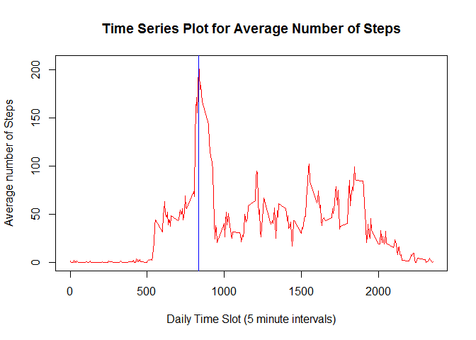

# Reproducible Research: Peer Assessment 1
Colesey  
Nov 8th 2015  
##Introduction  
This assignment makes use of data from a personal activity monitoring
device. This device collects data at 5 minute intervals through out the
day. The data consists of two months of data from an anonymous
individual collected during the months of October and November, 2012
and include the number of steps taken in 5 minute intervals each day.


The objective of this reproducible research is to answer a number of questions using the data provided:  
1. What is mean total number of steps taken per day?  
2. What is the average daily activity pattern?  
3. Imputing missing values  
4. Are there differences in activity patterns between weekdays and weekends?  

In the data set, the variables are:

* **steps**: Number of steps taking in a 5-minute interval (missing
    values are coded as `NA`)

* **date**: The date on which the measurement was taken in YYYY-MM-DD
    format

* **interval**: Identifier for the 5-minute interval in which
    measurement was taken


## Loading and preprocessing the data
The following code assumes that the data files have been downloaded and unzipped in the current working directory.

The data is loaded from activities.csv and into the data frame called activities. Then convert the date variable from a factor to a date using strptime() function and converting it's output to POSIXct as required later when using the group_by() function.


```r
activities <- read.csv(file= "activity.csv", header=TRUE)
activities$date <- as.POSIXct(strptime(activities$date, format = "%Y-%m-%d"))
```

The summary function output is displayed here (only because I can). I've used the kable() function instead of the xtable because the later refused to format properly into the HTML document. The kable() snippet was found on Stack Overflow (and is better than xtable but still not perfect).


```r
library(knitr)

sum_info <- summary(activities)
kable(sum_info, format = "html", padding = 1, row.names=TRUE)
```

<table>
 <thead>
  <tr>
   <th style="text-align:left;">   </th>
   <th style="text-align:left;">     steps </th>
   <th style="text-align:left;">      date </th>
   <th style="text-align:left;">    interval </th>
  </tr>
 </thead>
<tbody>
  <tr>
   <td style="text-align:left;">  </td>
   <td style="text-align:left;"> Min.   :  0.00 </td>
   <td style="text-align:left;"> Min.   :2012-10-01 00:00:00 </td>
   <td style="text-align:left;"> Min.   :   0.0 </td>
  </tr>
  <tr>
   <td style="text-align:left;">  </td>
   <td style="text-align:left;"> 1st Qu.:  0.00 </td>
   <td style="text-align:left;"> 1st Qu.:2012-10-16 00:00:00 </td>
   <td style="text-align:left;"> 1st Qu.: 588.8 </td>
  </tr>
  <tr>
   <td style="text-align:left;">  </td>
   <td style="text-align:left;"> Median :  0.00 </td>
   <td style="text-align:left;"> Median :2012-10-31 00:00:00 </td>
   <td style="text-align:left;"> Median :1177.5 </td>
  </tr>
  <tr>
   <td style="text-align:left;">  </td>
   <td style="text-align:left;"> Mean   : 37.38 </td>
   <td style="text-align:left;"> Mean   :2012-10-30 23:32:27 </td>
   <td style="text-align:left;"> Mean   :1177.5 </td>
  </tr>
  <tr>
   <td style="text-align:left;">  </td>
   <td style="text-align:left;"> 3rd Qu.: 12.00 </td>
   <td style="text-align:left;"> 3rd Qu.:2012-11-15 00:00:00 </td>
   <td style="text-align:left;"> 3rd Qu.:1766.2 </td>
  </tr>
  <tr>
   <td style="text-align:left;">  </td>
   <td style="text-align:left;"> Max.   :806.00 </td>
   <td style="text-align:left;"> Max.   :2012-11-30 00:00:00 </td>
   <td style="text-align:left;"> Max.   :2355.0 </td>
  </tr>
  <tr>
   <td style="text-align:left;">  </td>
   <td style="text-align:left;"> NA's   :2304 </td>
   <td style="text-align:left;"> NA </td>
   <td style="text-align:left;"> NA </td>
  </tr>
</tbody>
</table>


## What is mean total number of steps taken per day?
Ignoring NA values for this exercise. 
Using dplyr to group the data by the date variable, I've created a table called byDate that is then used to summarise (I'm English) the data into a table called stepsPerDay. This is used to produce the histogram the mean and the median.

First task is to produce a histogram plot of the steps per day. This is shown with the base plotting hist() function with the breaks argument set to 20 to provide a little granularity in the plot.
The We are calculate both the mean and the median for the number of steps taken per day across the sample period.   

For additional information, a rug plot has been added to the histogram.  

Note: I've set warn.conflicts to FALSE when loading the dplry library to tidy up the output html file.


```r
library(dplyr, warn.conflicts = FALSE)
byDate <- group_by(activities, date)
stepsPerDay <- summarise(byDate, sum(steps))
hist(stepsPerDay$"sum(steps)", col="blue", 
     main ="Histogram of Steps per Day",
     xlab = "Number of steps per day",
     breaks = 20)
rug(stepsPerDay$"sum(steps)")
```

 

```r
mean_steps <- mean(stepsPerDay$"sum(steps)", na.rm = TRUE)
median_steps <- median(stepsPerDay$"sum(steps)", na.rm = TRUE)
```

The mean steps per day is **10766** and the median is **10765**.  


## What is the average daily activity pattern?

1. Make a time series plotof the 5-minute interval (x-axis) and the average number of steps taken, averaged across all days (y-axis)  
  
To achieve this, we create an array object using the tapply() function that groups the data by the slot in the day defined by the interval value and finding the mean number of steps taken in that slot. The array is named dailyActivitiy.  
This is then plotted as a time series graph using the base graphics plot() function.  
I've added a line at the point of maximum average steps in a 5 minute interval to help with the second question in this section.  


```r
dailyActivity <- tapply(activities$steps, activities$interval, mean, na.rm=TRUE)

plot(row.names(dailyActivity), dailyActivity, type="l", col="red", 
     main = "Time Series Plot for Average Number of Steps",
     xlab = "Daily Time Slot (5 minute intervals)",
     ylab = "Average number of Steps")

max_act <- dailyActivity[dailyActivity== max(dailyActivity)]
abline(v=as.numeric(names(max_act)), col = "blue")
```

 
  
2. Which 5-minute interval, on average across all the days in the dataset, contains the maximum number of steps?    

To answer this question we find the time slot with the highest mean in the dailyActivity array.  
The index of the array is the time of day that the mean occurs in. In this case, 08:35 with a mean value of 206.1698 steps.


```r
high_mean <- dailyActivity[dailyActivity ==max(dailyActivity)]
print(high_mean)
```

```
##      835 
## 206.1698
```
The highest average number of steps in a 5 minute time slot is **206.1698113** steps and the time slot is **08:35**


## Imputing missing values

Within the data there are a number of days/intervals where there are missing
values (coded as `NA`). The presence of missing days may introduce
bias into some calculations or summaries of the data. Associated with this the task is to work out a strategy for removing the NA values to understand the effect of them. This task is divided into 5 actions 

1. Calculate and report the total number of missing values in the dataset (i.e. the total number of rows with `NA`s)


```r
colSums(is.na(activities))
```

```
##    steps     date interval 
##     2304        0        0
```
  
From the output of the colSums() function we can see that there are a total of 2304 missing values and they are all in the Steps variable.  

2. Devise a strategy for filling in all of the missing values in the dataset.   

The strategy chosen is to fill each missing value with the mean for that time 5-minute time slot. To do this, we will take the activities data frame and replace the NA values using the replace() function with the mean values for the time slot that we have in dailyActivity in a new data frame called actNaRep.  
Then use the new data frame to re-run the histogram plot.


```r
#Create a copy of the data frame to use in this exercise
actNaRep <- activities
#create an index of the NA values in the steps variable of actNaRep and call it NA_index
NA_index <- which(is.na(actNaRep$steps)==TRUE)
#The use the replace() function to change the NA values in the actNaRep to the corresponding value in the dailyActivity mean value
actNaRep$steps <- replace(actNaRep$steps, NA_index, dailyActivity[NA_index])


byDateNaRep <- group_by(actNaRep, date)
stepsPerDayNaRep <- summarise(byDateNaRep, sum(steps))
hist(stepsPerDayNaRep$"sum(steps)", col="blue", 
     main ="Histogram of Steps per Day (modified)",
     sub="with NA values replaced with the mean for the ineterval",
     xlab = "Number of steps per day",
     breaks = 20)
rug(stepsPerDayNaRep$"sum(steps)")
```

 

```r
mean(stepsPerDayNaRep$"sum(steps)", na.rm = TRUE)
```

```
## [1] 10766.19
```

```r
median(stepsPerDayNaRep$"sum(steps)", na.rm = TRUE)
```

```
## [1] 10765.59
```
  
4. Make a histogram of the total number of steps taken each day and Calculate and report the mean and median total number of steps taken per day. Do these values differ from the estimates from the first part of the assignment? What is the impact of imputing missing data on the estimates of the total daily number of steps?  

The histogram for the modified data frame is shown above and we can compare the original with the modified histograms. These show the impact of replacing the NA values with the mean value for the interval is minimal. The effect is to increase the number of useable observations in the data set.


```r
par(mfrow = c(2,1))

hist(stepsPerDay$"sum(steps)", col="blue", 
     main ="Histogram of Steps per Day",
     xlab = "Number of steps per day",
     breaks = 20)

hist(stepsPerDayNaRep$"sum(steps)", col="blue", 
     main ="Histogram of Steps per Day (modified)",
     sub="with NA values replaced with the mean for the ineterval",
     xlab = "Number of steps per day",
     breaks = 20)
```

 

```r
#Calculate the revised mean and median values

mean_steps_NaRep <- mean(stepsPerDayNaRep$"sum(steps)", na.rm = TRUE)
median_steps_NaRep <- median(stepsPerDayNaRep$"sum(steps)", na.rm = TRUE)
```
  
The mean value for the data set with the NAs replaced with the mean values is **10766** and for the original data set it was **10766**.  
The median value for the data set witht he NAs replaced with mean values is **10765** compared to the value for the original which was **10765**.  
From both of these we can see that the mean and median values has remained unchanged as a result of the strategy for replacing the NA steps observations.  


## Are there differences in activity patterns between weekdays and weekends?

The objective of this question is to produce a compartive plot showing the mean number of steps per daily interval for weekdays and weekend. This will show any differance in the profile between the two. 

To achieve this, we add a new variable to the data set that extracts ther day of the week using the weekdays() function adding it to the actNaRep data frame using the mutate() function from dplyr. Then we convert it to a weekday or weekend factor varibale using the ifelse() function.  
Using the tapply() function with two grouping variables, we create an array, coerced to a data frame, that gives us the mean number of steps per time slot per weekend or weekday.  
To this, we add back in the interval variable from the row names as a numeric variable. Finally, we melt() the data frame with the interval as the id variable to give us a data fram that lattice can use to build the condtioned plots from.


```r
library(lattice)
library(reshape2)
#Use the mutate() function to add a new varible called weekday that give the day of the week from the date variable
actNaRep <- mutate(actNaRep, weekday = as.factor(weekdays(actNaRep$date)))

#convert the weekday to weekend or weekday and make it a factor
actNaRep$weekday <-ifelse(actNaRep$weekday == "Saturday" | actNaRep$weekday =="Sunday", "weekend", "weekday")
actNaRep$weekday <- as.factor(actNaRep$weekday)

#Create a data frame with the mean of steps per interval per weekend or weekday factor
weekAct <- as.data.frame(tapply(actNaRep$steps, list(actNaRep$interval, actNaRep$weekday), mean, na.rm=TRUE))
#Bring back the rownames as a variable 
weekAct <- cbind(interval = as.numeric(rownames(weekAct)), weekAct)

#melt the dataframe around the interval  
weekActFinal <- melt(weekAct, id="interval")

#The panel plot using Lattice
xyplot(weekActFinal$value~weekActFinal$interval | weekActFinal$variable, 
       type="l", 
       layout = c(1,2),
       main = " Mean Steps per Interval in the Day",
       xlab = "Interval in Day",
       ylab = "Mean Number of Steps")
```

 
  
  
From the two charts, we can see that the activity begins later, has higher step rates throughout the day and carries on later into the evening. the weekday plot shows the highest step rate at the start of the day and a much lower rate during the working hours.

The end.
